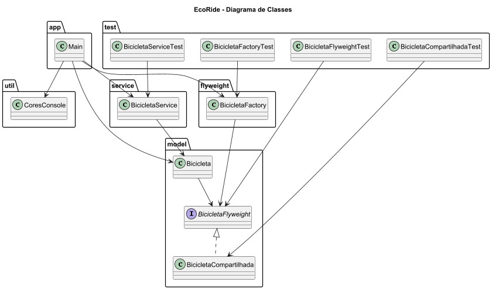

# EcoRide

Sistema inteligente de compartilhamento de bicicletas desenvolvido em Java utilizando o padrão de projeto Flyweight.

O projeto simula um sistema moderno de aluguel de bicicletas compartilhadas, permitindo otimização de memória através do compartilhamento de características comuns entre objetos.

---

# Padrão de Projeto Utilizado

## Flyweight

O padrão estrutural Flyweight foi utilizado para reduzir o consumo de memória compartilhando estados comuns entre múltiplos objetos.

### Estrutura do padrão no projeto

| Papel | Classe |
|---|---|
| Flyweight | BicicletaFlyweight |
| ConcreteFlyweight | BicicletaCompartilhada |
| FlyweightFactory | BicicletaFactory |
| Context | Bicicleta |

---

# Diagrama de Classes



---

# Funcionalidades

- Cadastro de bicicletas
- Compartilhamento de características
- Economia de memória
- Gerenciamento de bicicletas
- Simulação de aluguel
- Interface via console

---

# Estrutura do Projeto

```text
EcoRide/
│
├── src/
│   ├── main/
│   │   ├── app/
│   │   │   └── Main.java
│   │   │
│   │   ├── model/
│   │   │   ├── Bicicleta.java
│   │   │   ├── BicicletaFlyweight.java
│   │   │   └── BicicletaCompartilhada.java
│   │   │
│   │   ├── flyweight/
│   │   │   └── BicicletaFactory.java
│   │   │
│   │   ├── service/
│   │   │   └── BicicletaService.java
│   │   │
│   │   └── util/
│   │       └── CoresConsole.java
│   │
│   └── test/
│       ├── BicicletaFactoryTest.java
│       ├── BicicletaServiceTest.java
│       ├── BicicletaCompartilhadaTest.java
│       └── BicicletaFlyweightTest.java
│
├── docs/
│   ├── diagrama-classe.md
│   └── diagrama-classe.png
│
├── README.md
│
└── .gitignore
```

---

# Tecnologias Utilizadas

- Java 17
- IntelliJ IDEA
- JUnit 5
- Mermaid
- Git

---

# Execução do Projeto

## Executando a aplicação

Execute a classe principal:

```text
src/main/app/Main.java
```

Ou execute pelo terminal:

```bash
javac src/main/app/Main.java
java src/main/app/Main
```

---

# Execução dos Testes

Os testes automatizados estão localizados em:

```text
src/test
```

## Executando no IntelliJ

- Clique com o botão direito na pasta `test`
- Selecione:
Run Tests

---

# Casos de Teste Implementados

## BicicletaFactoryTest

- Compartilhamento de flyweights
- Criação de flyweights

## BicicletaCompartilhadaTest

- Criação de bicicletas compartilhadas
- Verificação de atributos

## BicicletaFlyweightTest

- Implementação do flyweight
- Compartilhamento de objetos

## BicicletaServiceTest

- Cadastro de bicicletas
- Inicialização da lista
- Cadastro múltiplo

---

# Exemplo de Funcionamento

```text
Bicicleta 001 | Modelo: Urbana | Cor: Azul | Fabricante: EcoBike

Bicicleta 002 | Modelo: Urbana | Cor: Azul | Fabricante: EcoBike

Flyweights criados: 1
```

---
